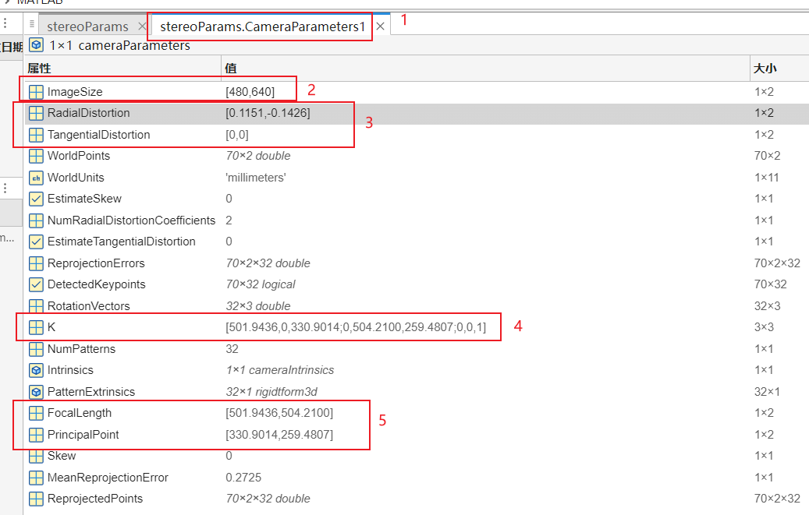

## 1、相机参数说明

| matlab | opencv | 含义 |
|:-------:|:-------:|:-------:|
| ImageSize         | Camera.height Camera.width | 图像分辨率（宽、高） |
| RadialDistortion  | Camera.k1 Camera.k2 | 图像径向畸变系数 |
| TangentialDistortion  | Camera.p1 Camera.p2 | 图像切向畸变系数 |
| K  | K | 内参矩阵 |
| FocalLength  | Camera.fx Camera.fy | 内参矩阵里的焦距 |
| PrincipalPoint  | Camera.cx Camera.cy | 内参矩阵里的光心坐标 |

----
## 2、外参矩阵

| matlab | opencv | 含义 |
|:-------:|:-------:|:-------:|
| Translation | Tlr.T | 平移向量 |
| R  | Tlr.R | 旋转矩阵 |
| A  | Tlr | 外参矩阵 |

**注意**： 平移向量的单位是mm，而opencv使用单位是m，所以使用的时候需要自己转换单位