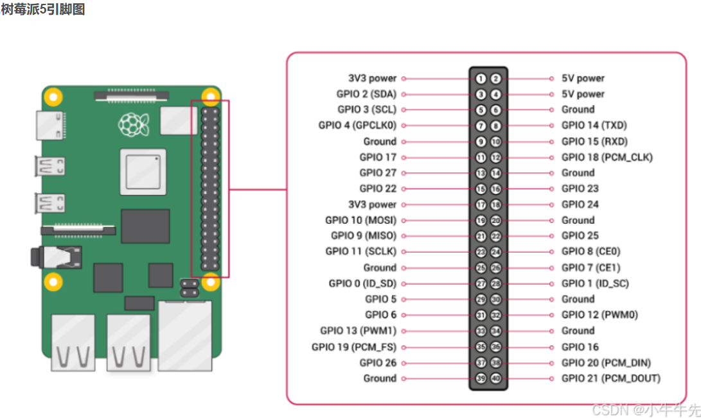

## 树莓派5引脚图


---

# 📌 树莓派 5 + Ubuntu 24.04（Noble）启用 GPIO 串口使用总结

## ✅ 1. 系统环境

你使用的是：

* **Raspberry Pi 5**
* **Ubuntu 24.04 LTS (Noble)**
* 默认不会自动启用 GPIO UART

因此必须通过 **编辑 /boot/firmware/config.txt 和设备树 overlay** 手动启用。

---

## ✅ 2. 编辑启动配置文件启用 UART0（GPIO14/15）

打开配置文件：

```bash
sudo nano /boot/firmware/config.txt
```

在文件末尾添加：

```ini
# ===== 启用树莓派 5 GPIO 串口 UART0 =====
enable_uart=1
dtoverlay=disable-bt
dtoverlay=uart0
```

说明：

* `enable_uart=1`：开启 SoC 的 UART 控制器
* `disable-bt`：禁用蓝牙，释放 UART0
* `uart0`：将 UART0 映射到 GPIO 14/15

保存后重启：

```bash
sudo reboot
```

---

## ✅ 3. 确认 UART 成功启用

重启后检查设备：

```bash
ls -l /dev/ttyAMA*
```

你应该得到：

```
/dev/ttyAMA0   ← GPIO 14/15 上的主 UART（可直接使用）
/dev/ttyAMA10  ← 内部 UART（无需理会）
```

说明 UART0 已成功启用。

---

## ✅ 4. UART0 对应的引脚（树莓派 5）

| 信号   | GPIO   | 物理引脚   | 说明        |
| ---- | ------ | ------ | --------- |
| TXD0 | GPIO14 | Pin 8  | Pi → 外部设备 |
| RXD0 | GPIO15 | Pin 10 | 外部设备 → Pi |
| GND  | ——     | Pin 6  | 必须接公共地    |

⚠️ 注意：必须使用 **3.3V TTL 电平** 的 USB-TTL 转换器。

---

## ✅ 5. 测试串口通信

### 使用 minicom

安装：

```bash
sudo apt install minicom -y
```

打开：

```bash
sudo minicom -b 115200 -o -D /dev/ttyAMA0
```

### 使用 Python

```python
import serial, time

ser = serial.Serial('/dev/ttyAMA0', 115200, timeout=1)

while True:
    ser.write(b'Hello from Pi5 UART0!\n')
    time.sleep(1)
```

---

## 🔍 6. 验证内核日志（可选）

```bash
sudo dmesg | grep tty
```

你已经看到：

```
ttyAMA0
```

表示 UART0 已成功加载。

---

## 🔧 7. 可选：创建符号链接 /dev/serial0

Ubuntu 默认不会自动创建，你可以自己加：

```bash
sudo nano /etc/udev/rules.d/99-serial.rules
```

写入：

```
KERNEL=="ttyAMA0", SYMLINK+="serial0"
```

重启后：

```
/dev/serial0 -> /dev/ttyAMA0
```

---

# 🎉 总结一句话

**在 Ubuntu 24.04 上启用树莓派 5 的 GPIO 串口的方法，是在 /boot/firmware/config.txt 中添加 enable_uart=1、dtoverlay=disable-bt、dtoverlay=uart0，重启后使用 /dev/ttyAMA0。**

---
