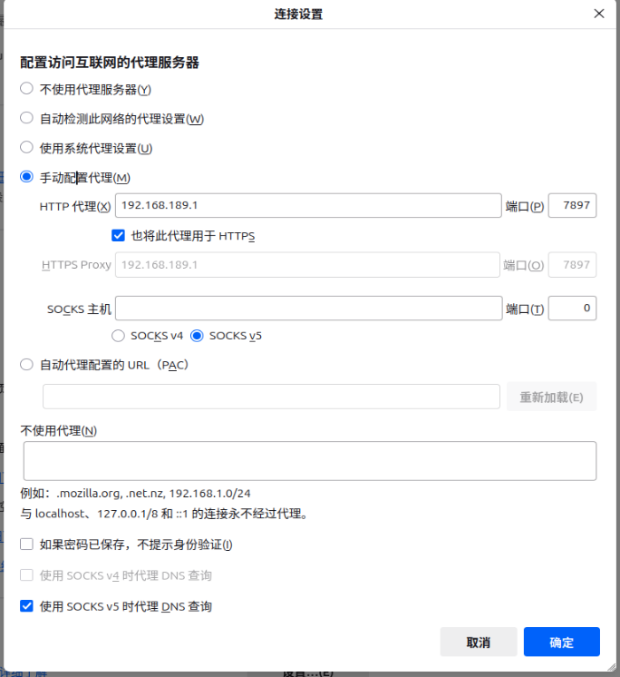

# 虚拟机NAT模式

## 1、虚拟机无法使用主机的代理服务  

### （Hiddify代理）

首先确认主机可以访问如google.com
代理软件需开启运行局域网连接

* 第 1 步：确认代理服务监听地址：
```bash
netstat -ano | findstr 12334
```
看是否有下面这种监听：
```bash
TCP    0.0.0.0:12334      LISTENING     <PID>
```
有这个：说明代理允许局域网访问

* 第 2 步：临时关闭防火墙试试（管理员运行 CMD）：
```bash
netsh advfirewall set allprofiles state off
```
然后在虚拟机中再次尝试：
```bash
curl -x http://192.168.189.1:12334 http://www.google.com
```
如果这次通了，说明是防火墙的问题

* 第 3 步：添加防火墙放行规则（必须管理员 CMD 执行）：
```bash
netsh advfirewall firewall add rule name="Clash Proxy" dir=in action=allow protocol=TCP localport=12334
```
然后重新打开防火墙：
```bash
netsh advfirewall set allprofiles state on
```

* 第 4 步：确认虚拟机代理配置是否正确：

你需要把系统代理或浏览器代理设置为：

|选项 |	值 |
| :----: | :----: |
|代理地址|	192.168.189.1|
|端口 |	12334|
|类型|	HTTP 或 SOCKS5（建议试 HTTP）|


你也可以用 curl 继续测试：
```bash
curl -x http://192.168.189.1:12334 http://www.google.com
```

## #（clash_verge代理）

端口号改成clash_verge里设置的，这里就是7897




两个软件的代理设置不同，应该是因为hiddify没有明确开设某一端口作为代理，而clash_verge中可以明确设置端口号进行代理。

-----
## 2、更换网络后（连接不同wifi）虚拟机的网络服务出现异常
一般通过虚拟机的网络编辑器的还原默认设置自动配置可以解决。
