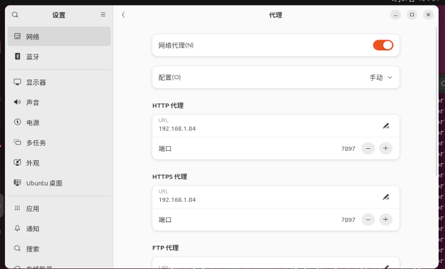

像你截图里这样在 **Ubuntu 系统代理** 里直接填主机的内网 IP (`192.168.1.84`) + 端口 (`7897`)，就能让虚拟机走主机的代理服务。

区别在于：

---

### 🔹 桥接模式

* 虚拟机就是一台独立设备，从路由器拿到自己的 IP。
* 你填主机的内网 IP（`192.168.1.84`），只要主机的代理服务开启了 **允许局域网访问**，虚拟机就能连上。
* 优点：虚拟机和主机都能在局域网里互相访问，适合需要外部设备直接访问虚拟机的场景（比如你要从手机访问 VM 里的服务）。

---

### 🔹 NAT 模式

* 虚拟机通过主机 NAT 上网，它在外部看不到独立 IP。
* 但虚拟机 **仍然可以访问主机的局域网 IP**（比如 `192.168.1.84:7897`），所以你这种系统代理配置同样有效。
* 优点：简单，不用担心路由器分配 IP，主机和虚拟机之间联通没问题。
* 缺点：外部设备不能直接访问虚拟机。

---

### 🔹 小提醒

* 如果你发现虚拟机里连不上，可能是主机的代理软件（Clash/V2Ray 等）没有勾选 **Allow LAN（允许局域网访问）**。
* 在这种情况下，NAT 模式可能会更省心，因为大多数虚拟机软件会自动处理虚拟机到主机的内网访问。

---

👉 所以总结：
你现在这种方式（在系统里直接配代理 IP 和端口），**桥接和 NAT 模式都能用**，关键在于主机的代理要能被虚拟机访问。

要不要我帮你写一个小测试方法（curl + 环境变量），让你验证虚拟机的流量确实走了代理？
