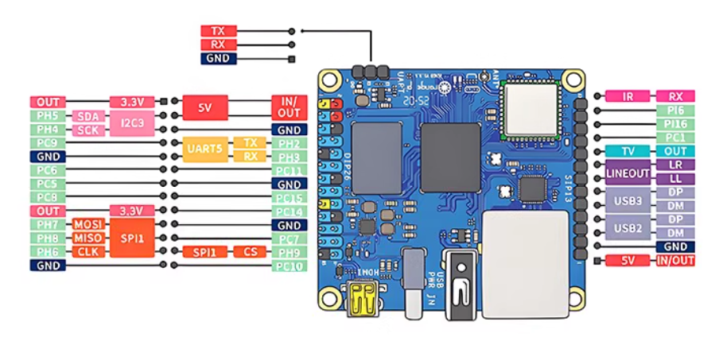

---
## 香橙派zero3引脚图


## 🧭 一、确定硬件接口

香橙派上 SoC（例如 H616）支持多个 UART，但**并不是所有都引出来**。

| UART 名称 | 设备节点         | 典型引脚（40Pin GPIO）          | 默认状态            |
| ------- | ------------ | ------------------------- | --------------- |
| UART0   | `/dev/ttyS0` | 调试口（板载 USB 串口）            | 已启用，用于系统日志      |
| UART1   | `/dev/ttyS1` | PIN 8 (TX) / PIN 10 (RX)  | 可用（需启用 overlay） |
| UART5   | `/dev/ttyS5` | PIN 32 (TX) / PIN 33 (RX) | ✅ 板上引出，最常用      |

> ⚠️ 电平为 **3.3 V TTL**，不要直接接 5 V 串口模块。

---

## ⚙️ 二、启用对应串口（最核心）

### 1️⃣ 编辑系统配置文件

打开：

```bash
sudo nano /boot/orangepiEnv.txt
```

添加或修改内容：

```bash
overlays=ph-uart5
param_uart5_rtscts=1
```
启动多个串口的时候可以这样写：
```bash
overlays=pi-uart2 pi-uart3 ph-uart5
param_uart2_rtscts=1
param_uart3_rtscts=1
param_uart5_rtscts=1
```

> * “ph-uart5” 是 Zero 3 的正确 overlay 名称（不是 uart5）
> * 如果用 UART1，则写 `overlays=uart1`

保存退出：`Ctrl+O` → 回车 → `Ctrl+X`

*overlays中ph-uart5的名称可能板子不同，名称也不同*

可以运行以下代码查看:
```bash
ls /boot/dtb/allwinner/overlay | grep uart5

#可能会输出以下内容
sun50i-h616-ph-uart2.dtbo 
sun50i-h616-ph-uart5.dtbo 
sun50i-h616-pi-uart2.dtbo 
sun50i-h616-pi-uart3.dtbo 
sun50i-h616-pi-uart4.dtbo
#说明串口5在overlay的正确名称是ph-uart5
```

---

### 2️⃣ 重启系统

```bash
sudo reboot
```

---

### 3️⃣ 验证是否生效

查看内核日志：

```bash
dmesg | grep ttyS
```

出现：

```
sunxi-uart 5002000.serial: ttyS5 at MMIO ...
```

✅ 表示 UART5 启用成功。

---

## 🚫 三、释放系统占用（防止冲突）

系统可能自动启动一个终端服务占用串口。

关闭它：

```bash
sudo systemctl stop serial-getty@ttyS5.service
sudo systemctl disable serial-getty@ttyS5.service
```

---

## 🔐 四、设置访问权限

串口默认属于 `dialout` 组。

检查：

```bash
ls -l /dev/ttyS5
groups orangepi
```

如果用户不在 `dialout` 组：

```bash
sudo usermod -aG dialout orangepi
```

重新登录生效。

---

## 🧪 五、测试串口是否工作

1. 短接 TX 与 RX（自发自收）
2. 安装 minicom：

   ```bash
   sudo apt install minicom -y
   ```
3. 打开测试：

   ```bash
   sudo minicom -D /dev/ttyS5 -b 115200
   ```
4. 输入字符 → 能回显即成功 ✅

---

## 🐍 六、Python 程序使用示例

```python
import serial
import time

# 打开串口
ser = serial.Serial('/dev/ttyS5', 115200, timeout=0.5)

# 发送数据
ser.write(b'Hello OrangePi!\n')

# 读取数据
while True:
    data = ser.readline()
    if data:
        print("Received:", data.decode().strip())
    time.sleep(0.1)
```

运行：

```bash
sudo python3 test_serial.py
```

---

## 🧠 七、常见问题与解决

| 问题                   | 可能原因              | 解决办法                                     |
| -------------------- | ----------------- | ---------------------------------------- |
| `Input/output error` | overlay 未启用或端口被占用 | 检查 `/boot/orangepiEnv.txt` 与 `systemctl` |
| `/dev/ttyS5` 不存在     | overlay 名写错或未加载   | 使用 `ph-uart5` 名称                         |
| 无法发送/接收数据            | TX/RX 接反、GND 未共地  | 检查连线                                     |
| 访问被拒绝                | 没有 dialout 权限     | 加入 `dialout` 组                           |
| 串口干扰、乱码              | 波特率不匹配            | 检查波特率设置                                  |

---

## 🧾 八、总结命令清单（最小可行步骤）

```bash
# 1. 编辑配置文件
sudo nano /boot/orangepiEnv.txt
# 添加:
# overlays=ph-uart5
# param_uart5_rtscts=1

# 2. 重启
sudo reboot

# 3. 验证
dmesg | grep ttyS

# 4. 停用占用服务
sudo systemctl stop serial-getty@ttyS5.service
sudo systemctl disable serial-getty@ttyS5.service

# 5. 测试
sudo minicom -D /dev/ttyS5 -b 115200
```

---
