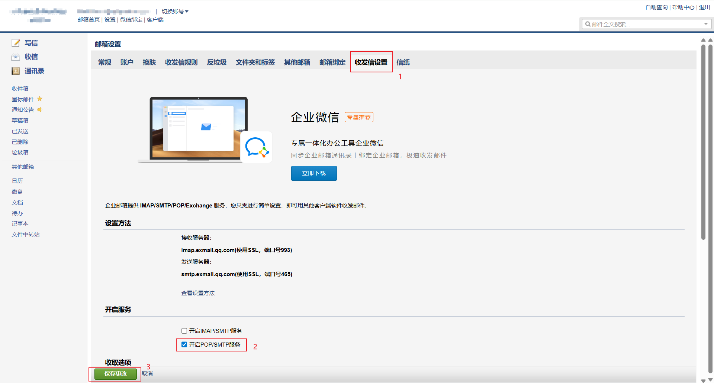
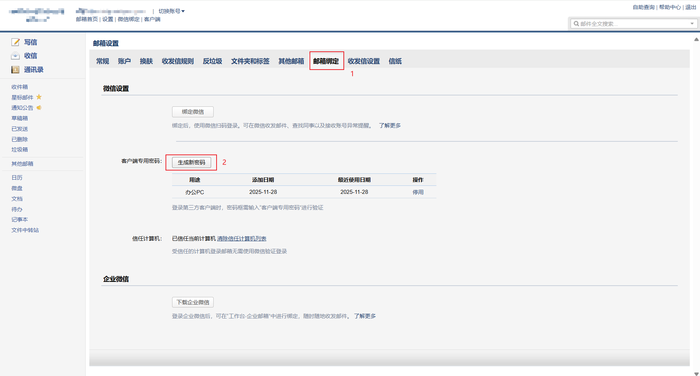

---

# 🍊 Orange Pi / 树莓派 IPv6 自动邮件通知完整方案

## 1️⃣ 安装必要依赖

在 Orange Pi / 树莓派上，先安装 `msmtp` 和 `dos2unix`：

```bash
sudo apt update
sudo apt install msmtp msmtp-mta dos2unix -y
```

* `msmtp` 用于发送邮件
* `dos2unix` 用于清理 Windows 编辑器可能留下的隐藏字符

确认 msmtp 路径：

```bash
which msmtp
# 通常是 /usr/bin/msmtp
```

---

## 2️⃣ 获取 SMTP 授权码（企业邮箱/企业微信邮箱）

### 1. 登录企业邮箱web邮箱后台（如 QQ 企业邮箱 / 企业微信邮箱）
用浏览器打开：https://exmail.qq.com/login

### 2. 进入设置，收发信设置,开启 **SMTP 服务**


### 3. 生成 **SMTP 授权码**（不同于登录密码）

*记得将这个授权码保存下来*

---

## 3️⃣ 配置 msmtp

创建用户配置文件：

```bash
nano ~/.msmtprc
```

内容示例（用你的邮箱和授权码替换）：

```
defaults
auth on
tls on
tls_starttls off
tls_trust_file /etc/ssl/certs/ca-certificates.crt

account default
host smtp.exmail.qq.com
port 465
from yourname@company.com
user yourname@company.com
password 你的SMTP授权码
```

设置权限：

```bash
# 香橙派
chown orangepi:orangepi ~/.msmtprc
# 树莓派
chown pi:pi ~/.msmtprc

chmod 600 ~/.msmtprc
dos2unix ~/.msmtprc
```

测试发送邮件：

```bash
echo -e "To: yourname@company.com\nSubject: 测试\n\n正文内容" | /usr/bin/msmtp yourname@company.com
```

---

## 4️⃣ 检测 IPv6 地址更改时发送邮件

### 创建ipv6地址自动检测脚本
```bash
sudo nano /home/orangepi/ipv6-watch.sh
```
填入以下内容：

```bash
#!/bin/bash

# 获取当前 IPv6（稳定的，不要临时 IPv6）
IPV6=$(ip -6 addr | grep "scope global" | grep -v "temporary" | awk '{print $2}' | head -n 1 | cut -d'/' -f1)

# 保存旧 IPv6 的文件
FILE=/home/orangepi/last_ipv6.txt

# 如果文件不存在，就创建
if [ ! -f "$FILE" ]; then
    echo "$IPV6" > $FILE
    exit 0
fi

OLD_IPV6=$(cat $FILE)

# 若 IPv6 变化则发邮件
if [ "$IPV6" != "$OLD_IPV6" ]; then
    echo "你的树莓派 IPv6 已更新：$IPV6" | msmtp yourname@company.com
    echo "$IPV6" > $FILE
fi
```

赋予执行权限：

```bash
chown orangep:orangepi ~/ipv6-watch.sh
chmod +x /home/orangepi/ipv6-watch.sh
```

测试脚本：

```bash
/home/orangepi/ipv6-watch.sh
```

### 用 crontab 定时运行（推荐每 10 分钟一次）
```bash
crontab -e
```

添加：
```bash
*/10 * * * * /home/orangepi/ipv6-watch.sh
```
保存即可

---


## 5️⃣ 开机自动发送 IPv6 地址（可选）

### 创建发送ipv6地址脚本
```bash
#!/bin/bash

# 获取全局 IPv6 地址（去掉临时和链路本地地址）
IPV6=$(ip -6 addr show scope global | grep inet6 | awk '{print $2}' | cut -d'/' -f1)

# 邮件内容
SUBJECT="Orange Pi IPv6 地址通知"
BODY="Orange Pi 已开机，IPv6 地址如下：\n\n$IPV6"

# 发送邮件
echo -e "To: laozhi@sydpower.com\nSubject: $SUBJECT\n\n$BODY" | msmtp yourname@company.com
```

### 使用systemd服务实现开机自启动

创建 systemd 服务文件

 ```bash
 sudo nano /etc/systemd/system/auto_send_ipv6.service
 ```

```bash
[Unit]
Description=Send IPv6 address via email at startup
After=network-online.target
Wants=network-online.target

[Service]
Type=oneshot
ExecStartPre=/bin/sleep 30
ExecStart=/home/orangepi/auto_send_ipv6.sh
User=orangepi
Group=orangepi

[Install]
WantedBy=multi-user.target
```

*ExecStartPre=/bin/sleep 30这一项是延时，确保开机后网络连接后才发送邮箱，可以自行更改时间（单位s）*

启用服务：

```bash
sudo systemctl daemon-reload
sudo systemctl enable auto_send_ipv6.service
sudo systemctl start auto_send_ipv6.service
```

检查状态：

```bash
systemctl status auto_send_ipv6.service
journalctl -u auto_send_ipv6.service
```

---
